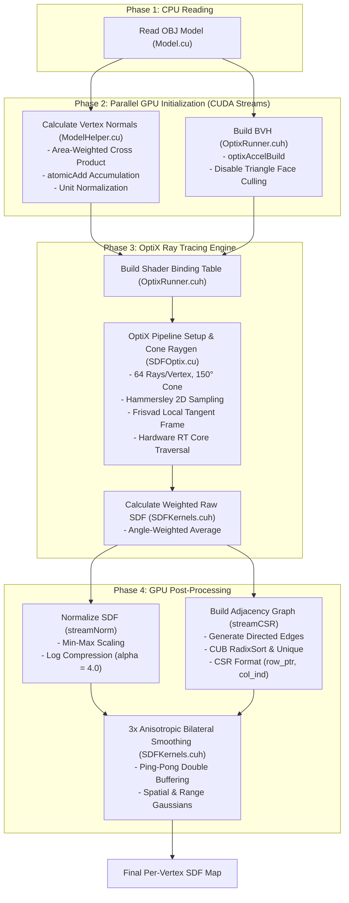

# Optimizing Shape Diameter Function using High Performance Computing


This thesis presents a **GPU-accelerated Shape Diameter Function (SDF) computation system** using NVIDIA OptiX. SDF assigns a scalar value to each vertex of a 3D mesh representing the local thickness of the model at that point — a fundamental geometric descriptor widely used in shape analysis, segmentation, and parameterization.

Unlike the traditional approach of casting rays on a CPU, our method uses **hardware-accelerated ray tracing (RT Cores)** to achieve speedups of **61.3x to 356.2x** over the PyMeshLab GPU reference implementation, while producing comparable output quality.

---

## What is the Shape Diameter Function?

Introduced by Shapira et al. [1], the SDF is a per-vertex scalar measure that captures the local "thickness" of a 3D model at any point on its surface. Conceptually, consider a point **p** on the mesh surface. If one looks along the inward normal direction **−n⃗**, the SDF quantifies how far one must travel before exiting the opposite side of the object.

However, a single ray along the inward normal may yield unreliable results on bumpy or irregular interior surfaces. To address this, the SDF casts a cone of **R rays** (typically R = 64) from point **p**, directed toward the interior of the model. Each ray records its travel distance **dᵢ** to the opposite wall, and the final SDF value is computed as a weighted average:

```
SDF(p) = Σ(dᵢ × wᵢ) / Σ(wᵢ)
```

where **wᵢ = 1/θᵢ** is the weight inversely proportional to the angle between the ray and the cone axis.

<p align="center">
  
  <br>
  <em>A 3D model with SDF values visualized as a heatmap. Red = thick, blue = thin.</em>
</p>

A thick region (like a human torso) produces large SDF values, while a thin region (like a finger) produces small values. Because the SDF depends purely on the object's volume, it remains **invariant to rigid transformations** — rotating or bending the model does not alter the thickness values.

---

## Why SDF: Role in 3D Object Analysis

Understanding an object's thickness provides essential geometric cues for:
- **Mesh segmentation**: Cutting a 3D model into logical pieces (e.g., separating an arm from a body because the wrist is thinner)
- **Skeletonization**: Finding the "bones" inside a 3D character by tracing the thickest parts
- **Shape matching and retrieval**: Identifying similar shapes across databases using thickness-based signatures that are pose-oblivious
- **Character animation**: Rigging and skinning by understanding volumetric properties

---

## Thesis Structure

This repository contains the full implementation for the following thesis chapters:

| Chapter | Description |
|---------|-------------|
| **1. Introduction** | SDF definition, context, survey of existing work, objectives |
| **2. Materials and Technologies** | Dataset, CUDA, NVIDIA CUB, NVIDIA OptiX |
| **3. Methodology** | Pipeline: OBJ loading → normals → BVH → ray tracing → post-processing |
| **4. Experiment Results** | Performance benchmarks, quality comparison, quality analysis |
| **5. Conclusion** | Limitations, conclusion, future work |

---

## Performance Benchmark: PyMeshLab GPU (VCGlib) vs. NVIDIA OptiX

| Model | Vertices | PyMeshLab GPU (s) | OptiX (s) | Speedup |
| :--- | :---: | :---: | :---: | :---: |
| 360.obj | 2,200 | 0.6134 | 0.0017 | **356.2x** |
| 9.obj | 2,639 | 0.6660 | 0.0025 | **269.5x** |
| 400.obj | 3,703 | 0.5736 | 0.0026 | **223.2x** |
| 76.obj | 5,923 | 0.5623 | 0.0028 | **200.2x** |
| 181.obj | 7,242 | 0.6296 | 0.0032 | **193.8x** |
| 118.obj | 9,153 | 0.5366 | 0.0042 | **128.4x** |
| 368.obj | 11,202 | 0.5933 | 0.0054 | **108.9x** |
| 112.obj | 13,628 | 1.4853 | 0.0229 | **64.9x** |
| 369.obj | 13,606 | 0.5912 | 0.0062 | **94.7x** |
| 158.obj | 14,587 | 0.6146 | 0.0077 | **79.4x** |
| 371.obj | 14,599 | 0.5464 | 0.0089 | **61.3x** |

**Key findings:**
- **OptiX is faster across all models**, ranging from **61.3x to 356.2x** speedup
- **PyMeshLab consistently requires >0.5 seconds**, even for small models, due to the fixed overhead of its 64-camera initialization and OpenGL context setup
- **OptiX processes models with up to 14,599 vertices within 8.9 milliseconds**, making it suitable for interactive applications

### Test Settings

| Parameter | OptiX (CUDA) | PyMeshLab GPU (VCGlib) |
| :--- | :--- | :--- |
| **Rays per vertex** | 64 | 64 |
| **Cone angle** | 150 degrees | 150 degrees |
| **Ray sampling** | Hammersley 2D (quasi-random) | Fibonacci sphere (uniform) |
| **Depth peeling layers** | N/A (single closest-hit via hardware BVH) | 10 layers |
| **Post-processing** | Log normalization + 3x anisotropic bilateral smoothing | None |
| **GPU** | NVIDIA RTX (OptiX RT Cores) | Any GPU with OpenGL 3.3+ |

---

## Methodology & Algorithmic Foundations

The Shape Diameter Function (SDF) pipeline transforms raw 3D polygon meshes into smooth, surface-aligned volumetric thickness values using NVIDIA OptiX. As detailed in Chapter 3 of the thesis report, the overall workflow is organized into four main phases: **Read OBJ Model**, **Parallel GPU Initialization**, **OptiX Ray Tracing Engine**, and **GPU Post-Processing**.



---

### Phase 1: Read OBJ Model

The pipeline begins by loading raw 3D mesh data from Wavefront `.obj` files ([`Model.cu`](file:///e:/Code/FinalProject/Core/Model.cu)). A 3D surface is defined by vertex coordinates in 3D space (`v` lines) and triangular faces connecting triplets of vertices (`f` lines).

1. **Index Conversion**: OBJ files use 1-based indexing. The parser converts indices to 0-based to align with GPU memory indexing.
2. **Matrix Upload**: Vertex positions and face connectivity indices are packed into host matrices and uploaded to GPU memory via `CopyToDevice()`:
   $$\mathbf{V} = \begin{bmatrix} x_0 & y_0 & z_0 \\ x_1 & y_1 & z_1 \\ \vdots & \vdots & \vdots \end{bmatrix}_{|V| \times 3}, \qquad \mathbf{F} = \begin{bmatrix} v_0^0 & v_1^0 & v_2^0 \\ v_0^1 & v_1^1 & v_2^1 \\ \vdots & \vdots & \vdots \end{bmatrix}_{|F| \times 3}$$

---

### Phase 2: Parallel GPU Initialization

To minimize pipeline startup overhead, two heavy initialization tasks are executed concurrently on independent CUDA streams (`streamNorm` and `streamBVH`):

#### 2.1 Calculate Vertex Normals ([`ModelHelper.cu`](file:///e:/Code/FinalProject/Core/ModelHelper.cu))
Vertex normals define inward directions for interior ray tracing. They are computed in two parallel GPU kernel passes:

1. **Area-Weighted Face Normal Accumulation** (`GPUNormalCaculation`):  
   For a triangle with vertices $\mathbf{v}_0, \mathbf{v}_1, \mathbf{v}_2$, the unnormalized face normal $\vec{n}_f$ is the cross product of its edge vectors $\vec{e}_1 = \mathbf{v}_1 - \mathbf{v}_0$ and $\vec{e}_2 = \mathbf{v}_2 - \mathbf{v}_0$:
   $$\vec{n}_f = \vec{e}_1 \times \vec{e}_2$$
   The magnitude $|\vec{n}_f|$ equals twice the triangle area, naturally weighting larger faces heavier. CUDA atomic addition (`atomicAdd`) safely accumulates face normals into adjacent vertices across concurrent threads:
   $$\vec{N}_{v_j} = \sum_{f \in \mathcal{F}(v_j)} \vec{n}_f$$
2. **Unit Normalization** (`GPUNormalizeVertexNormal`):  
   Accumulated vectors are normalized to unit length:
   $$\hat{\mathbf{n}}_v = \begin{cases} \frac{\vec{N}_v}{|\vec{N}_v|} & \text{if } |\vec{N}_v| > 0 \\ (0, 0, 1)^T & \text{otherwise} \end{cases}$$

#### 2.2 Build BVH Acceleration Structure ([`OptixRunner.cuh`](file:///e:/Code/FinalProject/src/Optix/OptixRunner.cuh))
To enable real-time ray traversal across millions of triangles, an OptiX Bounding Volume Hierarchy (BVH) Geometry Acceleration Structure (GAS) is built via `optixAccelBuild`:
- **`OPTIX_BUILD_FLAG_PREFER_FAST_TRACE`**: Optimizes BVH tree node layout for maximum RT Core ray traversal speed.
- **`OPTIX_GEOMETRY_FLAG_DISABLE_TRIANGLE_FACE_CULLING`**: Crucial switch enabling double-sided ray-triangle intersections, allowing inward rays to strike interior back-walls.

---

### Phase 3: OptiX Ray Tracing Engine

#### 3.1 Build Shader Binding Table (SBT)
The Shader Binding Table acts as a fast execution directory mapping ray tracing events to GPU device programs ([`OptixRunner.cuh`](file:///e:/Code/FinalProject/src/Optix/OptixRunner.cuh)):
- **Raygen Record**: Pointing to `__raygen__sdf_cone` for shooting cone rays.
- **Miss Record**: Null program, ignoring rays that miss geometry.
- **Hitgroup Record**: Pointing to `__closesthit__sdf` for recording travel distances.

#### 3.2 OptiX Pipeline Setup & Ray Generation ([`SDFOptix.cu`](file:///e:/Code/FinalProject/src/Optix/SDFOptix.cu))
The OptiX pipeline executes the core physics simulation by launching 64 rays per vertex into the mesh interior:

1. **Local Tangent Frame**: An orthonormal coordinate basis $(\mathbf{T}, \mathbf{B}, -\hat{\mathbf{n}}_v)$ is generated around the inward normal using the Frisvad method.
2. **Hammersley 2D Low-Discrepancy Sampling**: Ray directions inside a cone aperture of $\theta_{\text{max}} = 150^\circ$ ($2.61799\text{ rad}$) are generated using the base-2 Van der Corput sequence $\Phi_2(i)$:
   $$x_i = \frac{i}{R}, \quad y_i = \Phi_2(i) = \sum_{k=0}^{\lfloor \log_2 i \rfloor} b_k \cdot 2^{-(k+1)}, \quad \text{for } i \in \{0, \dots, 63\}$$
   $$\theta_i = x_i \cdot \frac{\theta_{\text{max}}}{2}, \quad \phi_i = 2\pi y_i$$
   $$\mathbf{d}_{\text{world}} = (\sin\theta_i \cos\phi_i) \mathbf{T} + (\sin\theta_i \sin\phi_i) \mathbf{B} + (\cos\theta_i) (-\hat{\mathbf{n}}_v)$$
3. **Hardware BVH Traversal & Payload**: `optixTrace` queries RT Cores. The closest-hit program `__closesthit__sdf` records distance $d_i = \text{optixGetRayTmax()}$ into a 32-bit payload. Any-Hit programs are disabled (`OPTIX_RAY_FLAG_DISABLE_ANYHIT`) for peak hardware throughput.

#### 3.3 Calculate Weighted Raw SDF ([`SDFKernels.cuh`](file:///e:/Code/FinalProject/src/Optix/SDFKernels.cuh))
The `GPUComputeRawSDF` kernel aggregates valid ray travel distances using an angle-weighted average, where weight $w_i = \frac{1}{\theta_i + \epsilon}$ penalizes wide-angle deflections:
$$\text{SDF}_{\text{raw}}(p) = \frac{\sum_{i=1}^{R_{\text{hit}}} d_i \cdot w_i}{\sum_{i=1}^{R_{\text{hit}}} w_i}$$

---

### Phase 4: GPU Post-Processing

To transform raw distances into a smooth heat map, the pipeline runs normalization and adjacency graph construction in parallel on separate CUDA streams before a final bilateral smoothing pass.

#### 4.1 Normalize SDF ([`SDFKernels.cuh`](file:///e:/Code/FinalProject/src/Optix/SDFKernels.cuh))
1. **Min-Max Scaling**: `GPUComputeSDFMinMax` finds minimum ($\text{SDF}_{\min}$) and maximum ($\text{SDF}_{\max}$) values to scale raw distances to $[0, 1]$:
   $$\hat{v} = \frac{\text{SDF}_{\text{raw}}(p) - \text{SDF}_{\min}}{\text{SDF}_{\max} - \text{SDF}_{\min}}$$
2. **Logarithmic Compression**: `GPUApplySDFNormalization` compresses dynamic range with parameter $\alpha = 4.0$ to preserve fine details on thin geometry:
   $$v_{\text{norm}} = \frac{\ln(4.0 \cdot \hat{v} + 1.0)}{\ln(5.0)}$$

#### 4.2 Build Adjacency Graph in CSR Format ([`SDFKernels.cuh`](file:///e:/Code/FinalProject/src/Optix/SDFKernels.cuh))
To enable 1-ring neighbor lookups without $O(|V|^2)$ memory overhead, mesh topology is packed into Compressed Sparse Row (CSR) format:
1. `GPUGenerateEdges`: Emits 6 directed edges per triangle face.
2. `cub::DeviceRadixSort::SortPairs`: Sorts edges by primary vertex ID on GPU.
3. `cub::DeviceSelect::Unique`: Removes duplicate manifold edges.
4. `GPUExtractCSR`: Converts unique edges into CSR arrays (`row_ptr` offset array `d_nbrOffsets` and `col_ind` list array `d_nbrLists`).

#### 4.3 Anisotropic Bilateral Smoothing ([`SDFKernels.cuh`](file:///e:/Code/FinalProject/src/Optix/SDFKernels.cuh))
The `AnisotropicSmoothingKernel` runs 3 iterations of bilateral filtering over the CSR 1-ring neighbor graph $\mathcal{N}(p)$ to eliminate high-frequency ray noise while preserving sharp feature boundaries:
$$v_p^{(k+1)} = \frac{\sum_{q \in \mathcal{N}(p)} \exp\left(-\frac{\|\mathbf{x}_p - \mathbf{x}_q\|^2}{2\sigma_s^2}\right) \exp\left(-\frac{(v_p^{(k)} - v_q^{(k)})^2}{2\sigma_r^2}\right) v_q^{(k)}}{\sum_{q \in \mathcal{N}(p)} \exp\left(-\frac{\|\mathbf{x}_p - \mathbf{x}_q\|^2}{2\sigma_s^2}\right) \exp\left(-\frac{(v_p^{(k)} - v_q^{(k)})^2}{2\sigma_r^2}\right)}$$
- **Spatial Gaussian**: $\sigma_s = 0.02 \cdot \text{diag}(\text{BoundingBox})$.
- **Range Gaussian**: $\sigma_r = 0.1$.
- **Ping-Pong Double Buffering**: Swaps input/output pointers (`d_sdfBuf1` $\leftrightarrow$ `d_sdfBuf2`) across iterations to prevent GPU memory race conditions.

---

### Source File Responsibilities Matrix

| Layer | File / Module | Key Functions & Responsibilities |
| :--- | :--- | :--- |
| **Entry & Orchestration** | [`main.cu`](file:///e:/Code/FinalProject/main.cu) | Program entry point, command-line parsing (`--preview`), directory scanning, Polyscope 3D visualizer integration, benchmark logging. |
| **Pipeline Interface** | [`interface.cu`](file:///e:/Code/FinalProject/src/Optix/interface.cu) | `CaculatingSDFUsingOptix()` pipeline orchestrator, stream synchronization, host-device allocations. |
| **OptiX Pipeline Engine** | [`OptixRunner.cuh`](file:///e:/Code/FinalProject/src/Optix/OptixRunner.cuh) | OptiX context initialization, GAS BVH construction, Shader Binding Table (SBT) build, `optixLaunch` invocation. |
| **OptiX Ray Tracing Shaders** | [`SDFOptix.cu`](file:///e:/Code/FinalProject/src/Optix/SDFOptix.cu) | Device PTX shaders: `__raygen__sdf_cone` (64 Hammersley rays inside tangent frame), `__closesthit__sdf` (distance recording). |
| **CUDA Post-Processing** | [`SDFKernels.cuh`](file:///e:/Code/FinalProject/src/Optix/SDFKernels.cuh) | `GPUComputeRawSDF`, log compression kernel, CUB CSR graph creation (`cub::DeviceRadixSort`), ping-pong bilateral smoothing. |
| **Geometry & Normal Utility** | [`ModelHelper.cu`](file:///e:/Code/FinalProject/Core/ModelHelper.cu) | Parallel face normal accumulation (`atomicAdd`) and unit normalization kernels. |
| **3D Mesh Data Model** | [`Model.cu`](file:///e:/Code/FinalProject/Core/Model.cu) | Wavefront `.obj` mesh reader, vertex/face memory management, Polyscope scene registration. |
| **Device Memory Manager** | [`MatrixMemoryManager.cu`](file:///e:/Code/FinalProject/Core/MatrixMemoryManager.cu) | Custom pitch-aligned GPU matrix memory allocator and host-device transfer routines. |

---

## Quality Comparison

The following figures show the SDF heat map from both implementations and their absolute difference. Hot colors (red/yellow) indicate larger SDF values (thicker regions), while cool colors (blue) indicate thinner regions.

| Model | OptiX | PyMeshLab | Difference |
| :--- | :---: | :---: | :---: |
| **112** |  |  |  |
| **118** |  |  |  |
| **158** |  |  |  |
| **181** |  |  |  |
| **368** |  |  |  |
| **369** |  |  |  |
| **371** |  |  |  |
| **400** |  |  |  |
| **76** |  |  |  |
| **9** |  |  |  |

The OptiX bilateral filter produces smoother results in uniform thickness regions, while the PyMeshLab depth peeling approach exhibits high-frequency noise on constant-thickness surfaces. The overall thickness distribution captured by both methods is consistent.

---

## Limitations

- **Static meshes only**: The system currently does not handle animated or deforming geometry, as the BVH is built once and not updated during animation.
- **Single reference comparison**: Evaluation is limited to PyMeshLab; a broader comparison against other SDF methods would strengthen the assessment.

---

## Setup and Run

> **NOTE: Windows Only**
> This project is designed for **Windows environments** and will not compile or run correctly on Linux or macOS.

### Prerequisites

- **Visual Studio**: C++ toolchain (MSVC)
- **nvcc**: NVIDIA CUDA Compiler toolkit (CUDA 20.0+)
- **NVIDIA RTX GPU**: For hardware-accelerated ray tracing (RT Cores)
- **OptiX 7.6 SDK**: Available from NVIDIA Developer
- **CMake**: Build system generator

### Build

```bat
git clone https://github.com/TommyDatLC/OptimizeSDF
cd OptimizeSDF
mkdir build
cd build
cmake .. -G "Visual Studio 17 2022" -A x64
cmake --build . --config Release
```

### Run

```bat
OptimizeSDF.exe
```

The program will iterate over all `.obj` models in the `Model/` directory, compute SDF using the OptiX pipeline, and compare against the PyMeshLab reference.

### Source Files

| File | Role |
|------|------|
| `main.cu` | Entry point: orchestrates full pipeline |
| `Core/Model.cu` | 3D mesh model reader (OBJ parser) |
| `Core/ModelHelper.cu` | GPU kernels for vertex normal computation |
| `src/Optix/SDFOptix.cu` | OptiX shaders: raygen + closest-hit (compiled to PTX) |
| `src/Optix/SDFKernels.cuh` | CUDA kernels: raw SDF, normalization, CSR graph, bilateral smoothing |
| `src/Optix/OptixRunner.cuh` | OptiX pipeline setup, BVH build, SBT construction |
| `src/Optix/interface.cu` | High-level orchestration of the full SDF pipeline |

---

## References

1. L. Shapira, A. Shamir, D. Cohen-Or, "Consistent Mesh Partitioning and Skeletonization using the Shape Diameter Function," *Visual Computer*, vol. 24, pp. 249–259, 2008.
2. J. Kamenický, "Parallelization of Shape Diameter Function Computation using OpenCL," *Proceedings of CESCG*, 204, 2014.
3. S. Chen, T. Liu, Z. Shu, S. Xin, Y. He, C. Tu, "Fast and robust shape diameter function," *PLoS ONE*, vol. 13, no. 1, e0190666, 2018.
4. P. Cignoni et al., "MeshLab: an Open-Source Mesh Processing Tool," *Sixth Eurographics Italian Chapter Conference*, pp. 129–136, 2008.
5. S. G. Parker et al., "OptiX: a general purpose ray tracing engine," *ACM SIGGRAPH 2010 papers*, pp. 1–13, 2010.
6. J. Nickolls et al., "Scalable parallel programming with CUDA," *Queue*, vol. 6, no. 2, pp. 40–53, 2008.
7. C. Tomasi and R. Manduchi, "Bilateral Filtering for Gray and Color Images," *ICCV*, pp. 839–846, 1998.
8. NVIDIA Corporation, "CUB: Cooperative primitives for CUDA C++."
9. X. Chen, A. Golovinskiy, T. Funkhouser, "A Benchmark for 3D Mesh Segmentation," *ACM SIGGRAPH*, 2009.
10. A. Baldacci et al., "GPU-based approaches for shape diameter function computation and its applications focused on skeleton extraction," *Computers & Graphics*, vol. 59, pp. 151–159, 2016.
