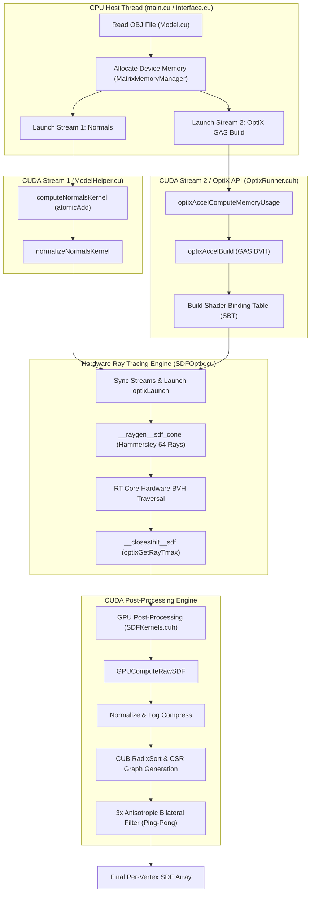
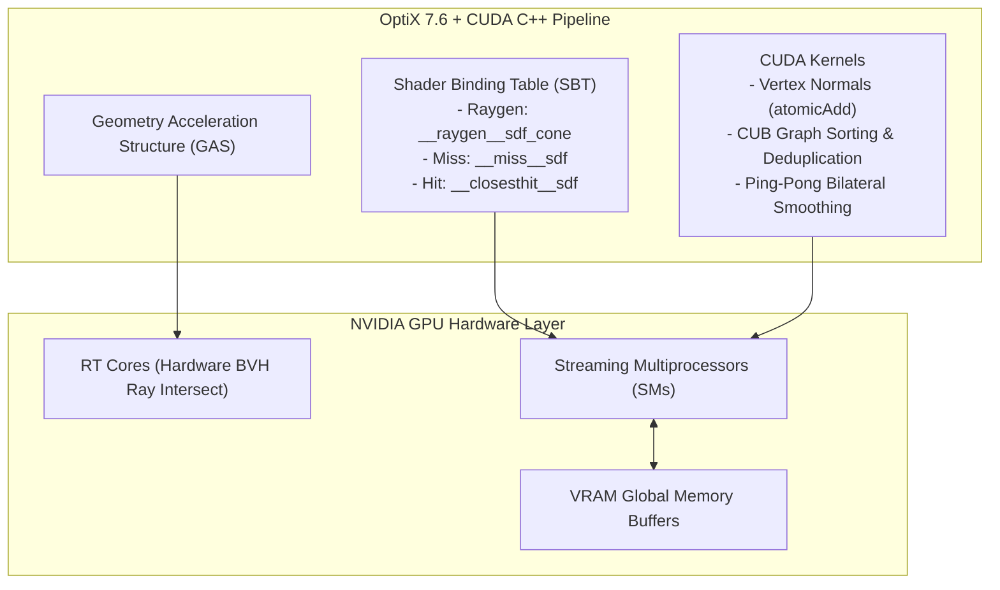

# Optimizing Shape Diameter Function using High Performance Computing


This thesis presents a **GPU-accelerated Shape Diameter Function (SDF) computation system** using NVIDIA OptiX. SDF assigns a scalar value to each vertex of a 3D mesh representing the local thickness of the model at that point — a fundamental geometric descriptor widely used in shape analysis, segmentation, and parameterization.

Unlike the traditional approach of casting rays on a CPU, our method uses **hardware-accelerated ray tracing (RT Cores)** to achieve speedups of **61.3x to 356.2x** over the PyMeshLab GPU reference implementation, while producing comparable output quality.

---

## What is the Shape Diameter Function?

Introduced by Shapira et al. [1], the SDF is a per-vertex scalar measure that captures the local "thickness" of a 3D model at any point on its surface. Conceptually, consider a point **p** on the mesh surface. If one looks along the inward normal direction **−n⃗**, the SDF quantifies how far one must travel before exiting the opposite side of the object.

However, a single ray along the inward normal may yield unreliable results on bumpy or irregular interior surfaces. To address this, the SDF casts a cone of **R rays** (typically R = 64) from point **p**, directed toward the interior of the model. Each ray records its travel distance **dᵢ** to the opposite wall, and the final SDF value is computed as a weighted average:

```
SDF(p) = Σ(dᵢ × wᵢ) / Σ(wᵢ)
```

where **wᵢ = 1/θᵢ** is the weight inversely proportional to the angle between the ray and the cone axis.

<p align="center">
  
  <br>
  <em>A 3D model with SDF values visualized as a heatmap. Red = thick, blue = thin.</em>
</p>

A thick region (like a human torso) produces large SDF values, while a thin region (like a finger) produces small values. Because the SDF depends purely on the object's volume, it remains **invariant to rigid transformations** — rotating or bending the model does not alter the thickness values.

---

## Why SDF: Role in 3D Object Analysis

Understanding an object's thickness provides essential geometric cues for:
- **Mesh segmentation**: Cutting a 3D model into logical pieces (e.g., separating an arm from a body because the wrist is thinner)
- **Skeletonization**: Finding the "bones" inside a 3D character by tracing the thickest parts
- **Shape matching and retrieval**: Identifying similar shapes across databases using thickness-based signatures that are pose-oblivious
- **Character animation**: Rigging and skinning by understanding volumetric properties

---

## Thesis Structure

This repository contains the full implementation for the following thesis chapters:

| Chapter | Description |
|---------|-------------|
| **1. Introduction** | SDF definition, context, survey of existing work, objectives |
| **2. Materials and Technologies** | Dataset, CUDA, NVIDIA CUB, NVIDIA OptiX |
| **3. Methodology** | Pipeline: OBJ loading → normals → BVH → ray tracing → post-processing |
| **4. Experiment Results** | Performance benchmarks, quality comparison, quality analysis |
| **5. Conclusion** | Limitations, conclusion, future work |

---

## Performance Benchmark: PyMeshLab GPU (VCGlib) vs. NVIDIA OptiX

| Model | Vertices | PyMeshLab GPU (s) | OptiX (s) | Speedup |
| :--- | :---: | :---: | :---: | :---: |
| 360.obj | 2,200 | 0.6134 | 0.0017 | **356.2x** |
| 9.obj | 2,639 | 0.6660 | 0.0025 | **269.5x** |
| 400.obj | 3,703 | 0.5736 | 0.0026 | **223.2x** |
| 76.obj | 5,923 | 0.5623 | 0.0028 | **200.2x** |
| 181.obj | 7,242 | 0.6296 | 0.0032 | **193.8x** |
| 118.obj | 9,153 | 0.5366 | 0.0042 | **128.4x** |
| 368.obj | 11,202 | 0.5933 | 0.0054 | **108.9x** |
| 112.obj | 13,628 | 1.4853 | 0.0229 | **64.9x** |
| 369.obj | 13,606 | 0.5912 | 0.0062 | **94.7x** |
| 158.obj | 14,587 | 0.6146 | 0.0077 | **79.4x** |
| 371.obj | 14,599 | 0.5464 | 0.0089 | **61.3x** |

**Key findings:**
- **OptiX is faster across all models**, ranging from **61.3x to 356.2x** speedup
- **PyMeshLab consistently requires >0.5 seconds**, even for small models, due to the fixed overhead of its 64-camera initialization and OpenGL context setup
- **OptiX processes models with up to 14,599 vertices within 8.9 milliseconds**, making it suitable for interactive applications

### Test Settings

| Parameter | OptiX (CUDA) | PyMeshLab GPU (VCGlib) |
| :--- | :--- | :--- |
| **Rays per vertex** | 64 | 64 |
| **Cone angle** | 150 degrees | 150 degrees |
| **Ray sampling** | Hammersley 2D (quasi-random) | Fibonacci sphere (uniform) |
| **Depth peeling layers** | N/A (single closest-hit via hardware BVH) | 10 layers |
| **Post-processing** | Log normalization + 3x anisotropic bilateral smoothing | None |
| **GPU** | NVIDIA RTX (OptiX RT Cores) | Any GPU with OpenGL 3.3+ |

---

## Methodology & Algorithmic Foundations

The Shape Diameter Function (SDF) pipeline transforms raw 3D polygon meshes into smooth, surface-aligned volumetric thickness values. The process is divided into six mathematically rigorous stages executed entirely on the GPU.

---

### 1. Vertex Normal Accumulation & Local Tangent Frame Construction

To cast inward-facing sampling cones from surface points, the system first calculates area-weighted vertex normals and establishes an orthonormal local coordinate frame for every vertex.

#### Area-Weighted Face Normals
For a triangle face $f$ with vertices $(\mathbf{v}_0, \mathbf{v}_1, \mathbf{v}_2)$, the unnormalized face normal vector $\mathbf{N}_{\text{face}}$ has magnitude equal to twice the triangle area:
$$\mathbf{N}_{\text{face}} = (\mathbf{v}_1 - \mathbf{v}_0) \times (\mathbf{v}_2 - \mathbf{v}_0)$$

In [`ModelHelper.cu`](file:///e:/Code/FinalProject/Core/ModelHelper.cu), the `computeNormalsKernel` utilizes CUDA atomic additions (`atomicAdd`) to safely accumulate face normals into adjacent vertex buffers across concurrent GPU threads:
$$\mathbf{N}_v = \text{normalize}\left(\sum_{f \in \text{Faces}(v)} \mathbf{N}_{\text{face}}\right)$$

#### Local Orthonormal Tangent Frame ($\mathbf{T}, \mathbf{B}, \mathbf{N}$)
To align local cone sampling rays with the inward surface normal $-\mathbf{N}_v$, an orthonormal basis $(\mathbf{T}, \mathbf{B}, -\mathbf{N}_v)$ is constructed without trigonometric overhead using the singularity-free Frisvad method:
$$\mathbf{T} = \begin{cases} 
\left(0, -1, 0\right) & \text{if } N_z > 0.99999 \\
\text{normalize}\left( \mathbf{N}_v \times (0, 0, 1) \right) & \text{otherwise}
\end{cases}, \quad \mathbf{B} = \mathbf{N}_v \times \mathbf{T}$$

---

### 2. Quasi-Random Sampling & Spherical Cone Mapping

Instead of uniform grid or random Monte Carlo sampling, ray directions inside the interior cone are generated via a 2D **Hammersley low-discrepancy sequence** ($R = 64$ rays per vertex) to maximize angular coverage and minimize variance.

#### 2D Hammersley Sequence
For ray index $i \in \{0, 1, \dots, R-1\}$, the sample pair $(x_i, y_i) \in [0, 1)^2$ is computed as:
$$x_i = \frac{i}{R}, \quad y_i = \Phi_2(i) = \sum_{k=0}^{\lfloor \log_2 i \rfloor} b_k \cdot 2^{-(k+1)}$$
where $\Phi_2(i)$ is the Radical Inverse Function in base 2 (Van der Corput sequence).

#### Spherical Cone Projection ($\theta_{\text{max}} = 150^\circ$)
Each sample pair $(x_i, y_i)$ is mapped to polar coordinates $(\theta_i, \phi_i)$ within a cone aperture of $\theta_{\text{max}} = 150^\circ$ ($2.61799 \text{ rad}$):
$$\theta_i = x_i \cdot \frac{\theta_{\text{max}}}{2}, \quad \phi_i = 2\pi y_i$$

The local 3D direction vector $\mathbf{d}_{\text{local}}$ is transformed into world coordinates $\mathbf{d}_{\text{world}}$ inside [`SDFOptix.cu`](file:///e:/Code/FinalProject/src/Optix/SDFOptix.cu) via matrix multiplication:
$$\mathbf{d}_{\text{local}} = \begin{pmatrix} \sin\theta_i \cos\phi_i \\ \sin\theta_i \sin\phi_i \\ \cos\theta_i \end{pmatrix}, \quad \mathbf{d}_{\text{world}} = d_x \mathbf{T} + d_y \mathbf{B} + d_z (-\mathbf{N}_v)$$

---

### 3. OptiX Hardware Ray Tracing & Angle-Weighted SDF Aggregation

#### RT Core Acceleration
Rays are launched via `optixTrace` through a hardware-built Geometry Acceleration Structure (GAS) BVH ([`OptixRunner.cuh`](file:///e:/Code/FinalProject/src/Optix/OptixRunner.cuh)). Face culling is disabled (`OPTIX_RAY_FLAG_DISABLE_ANYHIT`) so rays correctly hit interior mesh walls from both front and back faces. The closest intersection distance $d_i$ is extracted in `__closesthit__sdf` using `optixGetRayTmax()`.

#### Weighted Raw SDF Computation
Ray travel distances $d_i$ are aggregated per vertex in `GPUComputeRawSDF` ([`SDFKernels.cuh`](file:///e:/Code/FinalProject/src/Optix/SDFKernels.cuh)). Rays failing to hit geometry or exceeding maximum bounding box threshold are excluded. Valid hits are weighted inversely proportional to their deflection angle $\theta_i$:
$$w_i = \frac{1}{\theta_i + \epsilon}$$
$$SDF_{\text{raw}}(v) = \frac{\sum_{i=1}^{R_{\text{hit}}} d_i \cdot w_i}{\sum_{i=1}^{R_{\text{hit}}} w_i}$$

---

### 4. Logarithmic Range Compression

Raw SDF values exhibit wide dynamic ranges between thin limbs and thick body cores. Min-max normalization compresses values to $[0, 1]$, followed by non-linear logarithmic transformation ([`SDFKernels.cuh`](file:///e:/Code/FinalProject/src/Optix/SDFKernels.cuh)):
$$\widehat{SDF}(v) = \frac{SDF_{\text{raw}}(v) - SDF_{\text{min}}}{SDF_{\text{max}} - SDF_{\text{min}}}$$
$$SDF_{\text{log}}(v) = \frac{\ln(4.0 \cdot \widehat{SDF}(v) + 1.0)}{\ln(5.0)}$$

---

### 5. Topology Extraction & CSR Adjacency Graph Construction

To enable fast 1-ring neighbor lookups on the GPU, mesh topology is dynamically extracted and stored in Compressed Sparse Row (CSR) format:

```
Triangles (V0, V1, V2) ──► Directed Edges (V0-V1, V1-V0, ...) ──► CUB RadixSort ──► CUB Unique ──► CSR Arrays (row_offsets, col_indices)
```

1. **Edge Extraction**: For each triangle $(v_0, v_1, v_2)$, 6 directed edges are emitted into a GPU buffer.
2. **Key-Value Sorting**: `cub::DeviceRadixSort::SortPairs` sorts edges by primary source vertex ID.
3. **Deduplication**: `cub::DeviceSelect::Unique` filters out redundant shared manifold edges.
4. **CSR Conversion**: Parallel prefix sum computes `row_offsets` array, defining 1-ring neighbor adjacency lists for every vertex $v_i$.

---

### 6. Anisotropic Bilateral Surface Filtering

To remove high-frequency ray sampling noise while preserving sharp geometric boundaries (e.g. joints, edges), 3 iterations of anisotropic bilateral filtering are applied over the 1-ring neighbor graph ([`SDFKernels.cuh`](file:///e:/Code/FinalProject/src/Optix/SDFKernels.cuh)).

For vertex $v_i$ with 1-ring neighborhood $\mathcal{N}(i)$, the filtered value $SDF^{(k+1)}(i)$ is computed as:
$$SDF^{(k+1)}(i) = \frac{\sum_{j \in \mathcal{N}(i)} SDF^{(k)}(j) \cdot W(i, j)}{\sum_{j \in \mathcal{N}(i)} W(i, j)}$$

#### Dual Gaussian Weighting
The weight $W(i, j)$ combines spatial distance weight $G_s$ and scalar difference weight $G_r$:
$$W(i, j) = G_s\left(\|\mathbf{p}_i - \mathbf{p}_j\|\right) \cdot G_r\left(|SDF^{(k)}(i) - SDF^{(k)}(j)|\right)$$
$$G_s(r) = \exp\left(-\frac{r^2}{2\sigma_s^2}\right), \quad \text{where } \sigma_s = 0.02 \cdot \text{diag}(\text{BoundingBox})$$
$$G_r(d) = \exp\left(-\frac{d^2}{2\sigma_r^2}\right), \quad \text{where } \sigma_r = 0.1$$

Ping-pong double buffering is utilized across kernel launches to avoid memory race conditions during iterative updates.

---

## System & Software Architecture

### System Execution Flow & Dual CUDA Streams

The architecture leverages hardware parallelism by executing independent initialization tasks on concurrent CUDA streams before entering the OptiX hardware ray tracing pipeline.



### High-Performance Hardware Architecture Map



### Source File Responsibilities Matrix

| Layer | File / Module | Key Functions & Responsibilities |
| :--- | :--- | :--- |
| **Entry & Orchestration** | [`main.cu`](file:///e:/Code/FinalProject/main.cu) | Program entry point, command-line parsing (`--preview`), directory scanning, Polyscope 3D visualizer integration, benchmark logging. |
| **Pipeline Interface** | [`interface.cu`](file:///e:/Code/FinalProject/src/Optix/interface.cu) | `CaculatingSDFUsingOptix()` pipeline orchestrator, stream synchronization, host-device allocations. |
| **OptiX Pipeline Engine** | [`OptixRunner.cuh`](file:///e:/Code/FinalProject/src/Optix/OptixRunner.cuh) | OptiX context initialization, GAS BVH construction, Shader Binding Table (SBT) build, `optixLaunch` invocation. |
| **OptiX Ray Tracing Shaders** | [`SDFOptix.cu`](file:///e:/Code/FinalProject/src/Optix/SDFOptix.cu) | Device PTX shaders: `__raygen__sdf_cone` (64 Hammersley rays inside tangent frame), `__closesthit__sdf` (distance recording). |
| **CUDA Post-Processing** | [`SDFKernels.cuh`](file:///e:/Code/FinalProject/src/Optix/SDFKernels.cuh) | `GPUComputeRawSDF`, log compression kernel, CUB CSR graph creation (`cub::DeviceRadixSort`), ping-pong bilateral smoothing. |
| **Geometry & Normal Utility** | [`ModelHelper.cu`](file:///e:/Code/FinalProject/Core/ModelHelper.cu) | Parallel face normal accumulation (`atomicAdd`) and unit normalization kernels. |
| **3D Mesh Data Model** | [`Model.cu`](file:///e:/Code/FinalProject/Core/Model.cu) | Wavefront `.obj` mesh reader, vertex/face memory management, Polyscope scene registration. |
| **Device Memory Manager** | [`MatrixMemoryManager.cu`](file:///e:/Code/FinalProject/Core/MatrixMemoryManager.cu) | Custom pitch-aligned GPU matrix memory allocator and host-device transfer routines. |

---

## Quality Comparison

The following figures show the SDF heat map from both implementations and their absolute difference. Hot colors (red/yellow) indicate larger SDF values (thicker regions), while cool colors (blue) indicate thinner regions.

| Model | OptiX | PyMeshLab | Difference |
| :--- | :---: | :---: | :---: |
| **112** |  |  |  |
| **118** |  |  |  |
| **158** |  |  |  |
| **181** |  |  |  |
| **368** |  |  |  |
| **369** |  |  |  |
| **371** |  |  |  |
| **400** |  |  |  |
| **76** |  |  |  |
| **9** |  |  |  |

The OptiX bilateral filter produces smoother results in uniform thickness regions, while the PyMeshLab depth peeling approach exhibits high-frequency noise on constant-thickness surfaces. The overall thickness distribution captured by both methods is consistent.

---

## Limitations

- **Static meshes only**: The system currently does not handle animated or deforming geometry, as the BVH is built once and not updated during animation.
- **Single reference comparison**: Evaluation is limited to PyMeshLab; a broader comparison against other SDF methods would strengthen the assessment.

---

## Setup and Run

> **NOTE: Windows Only**
> This project is designed for **Windows environments** and will not compile or run correctly on Linux or macOS.

### Prerequisites

- **Visual Studio**: C++ toolchain (MSVC)
- **nvcc**: NVIDIA CUDA Compiler toolkit (CUDA 20.0+)
- **NVIDIA RTX GPU**: For hardware-accelerated ray tracing (RT Cores)
- **OptiX 7.6 SDK**: Available from NVIDIA Developer
- **CMake**: Build system generator

### Build

```bat
git clone https://github.com/TommyDatLC/OptimizeSDF
cd OptimizeSDF
mkdir build
cd build
cmake .. -G "Visual Studio 17 2022" -A x64
cmake --build . --config Release
```

### Run

```bat
OptimizeSDF.exe
```

The program will iterate over all `.obj` models in the `Model/` directory, compute SDF using the OptiX pipeline, and compare against the PyMeshLab reference.

### Source Files

| File | Role |
|------|------|
| `main.cu` | Entry point: orchestrates full pipeline |
| `Core/Model.cu` | 3D mesh model reader (OBJ parser) |
| `Core/ModelHelper.cu` | GPU kernels for vertex normal computation |
| `src/Optix/SDFOptix.cu` | OptiX shaders: raygen + closest-hit (compiled to PTX) |
| `src/Optix/SDFKernels.cuh` | CUDA kernels: raw SDF, normalization, CSR graph, bilateral smoothing |
| `src/Optix/OptixRunner.cuh` | OptiX pipeline setup, BVH build, SBT construction |
| `src/Optix/interface.cu` | High-level orchestration of the full SDF pipeline |

---

## References

1. L. Shapira, A. Shamir, D. Cohen-Or, "Consistent Mesh Partitioning and Skeletonization using the Shape Diameter Function," *Visual Computer*, vol. 24, pp. 249–259, 2008.
2. J. Kamenický, "Parallelization of Shape Diameter Function Computation using OpenCL," *Proceedings of CESCG*, 204, 2014.
3. S. Chen, T. Liu, Z. Shu, S. Xin, Y. He, C. Tu, "Fast and robust shape diameter function," *PLoS ONE*, vol. 13, no. 1, e0190666, 2018.
4. P. Cignoni et al., "MeshLab: an Open-Source Mesh Processing Tool," *Sixth Eurographics Italian Chapter Conference*, pp. 129–136, 2008.
5. S. G. Parker et al., "OptiX: a general purpose ray tracing engine," *ACM SIGGRAPH 2010 papers*, pp. 1–13, 2010.
6. J. Nickolls et al., "Scalable parallel programming with CUDA," *Queue*, vol. 6, no. 2, pp. 40–53, 2008.
7. C. Tomasi and R. Manduchi, "Bilateral Filtering for Gray and Color Images," *ICCV*, pp. 839–846, 1998.
8. NVIDIA Corporation, "CUB: Cooperative primitives for CUDA C++."
9. X. Chen, A. Golovinskiy, T. Funkhouser, "A Benchmark for 3D Mesh Segmentation," *ACM SIGGRAPH*, 2009.
10. A. Baldacci et al., "GPU-based approaches for shape diameter function computation and its applications focused on skeleton extraction," *Computers & Graphics*, vol. 59, pp. 151–159, 2016.
